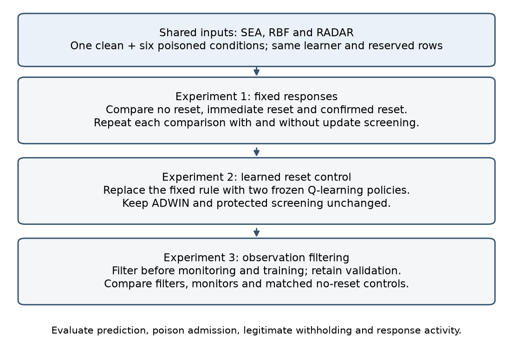
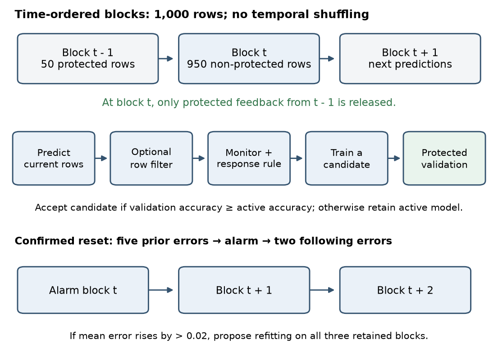
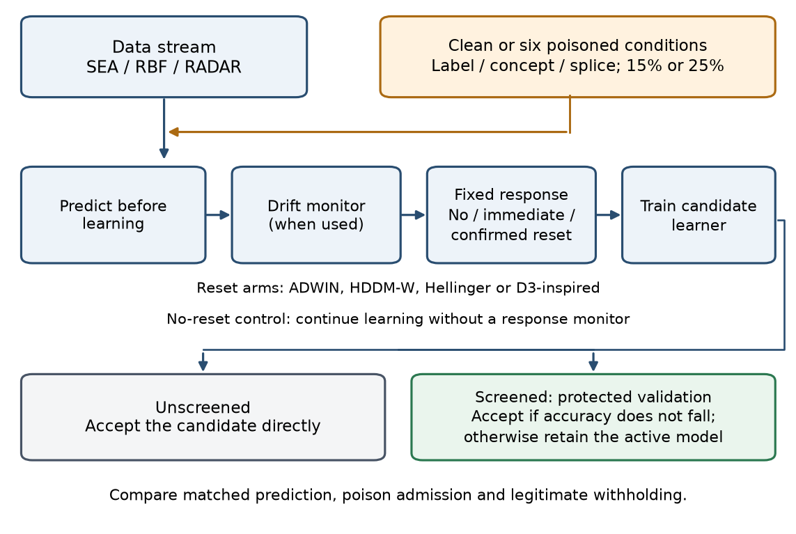
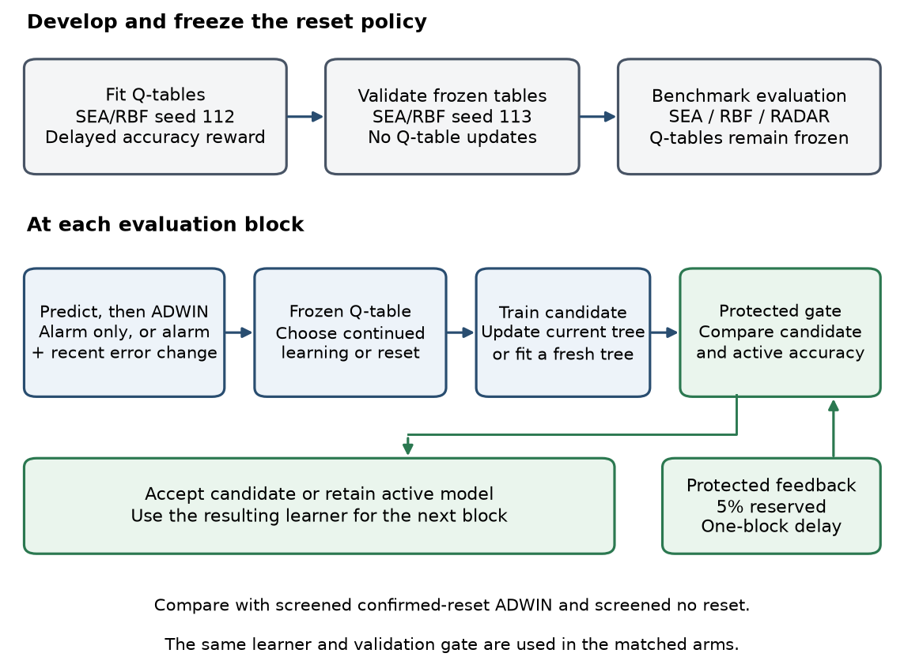
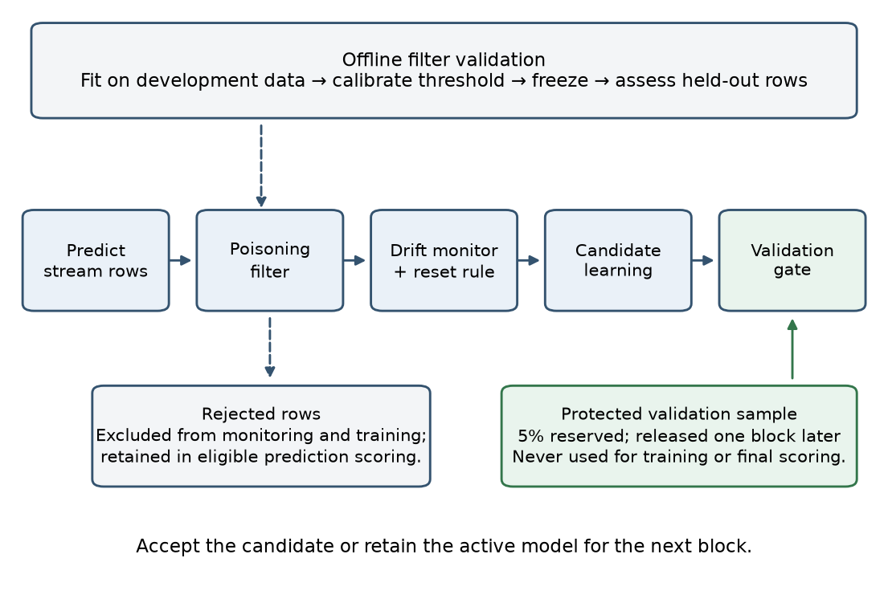

# Experiment design

The study asks whether adaptive defences can reduce poisoning exposure while retaining useful prediction under drift. The shared host model is an incremental Hoeffding Tree. SEA and Random RBF provide scheduled synthetic changes. RADAR supplies one assembled laboratory ransomware stream with eight classes.

## Sequence

1. Measure continuous learning without resets on clean inputs and six poisoned conditions: label, generated-concept and splice interventions at nominal rates of 15% and 25%. Apply passive monitors separately.
2. Compare fixed no-reset, immediate-reset and confirmed-reset responses. Compare each screened arm with its unscreened counterpart.
3. Compare two frozen tabular Q-learning reset controllers with the fixed screened reference.
4. Evaluate upstream filters before monitoring and candidate learning. Compare learned filters with no filter and matched oracle/random withholding controls. Add matched continuous-learning controls without resets.

## Threat model and temporal ordering

The experiment constructs the poison marks. They provide evaluation truth rather than a detector's estimate of attacker intent. The attacker has access to the labelled source archive. It changes labels, generates replacement feature blocks or copies source segments. It does not adapt to the defender. Protected observations retain their original features and labels.

Blocks contain 1,000 observations. Predictions precede ordinary learning. Five percent of positions are reserved for reliable protected feedback and released one block later. The protected rows do not train the classifier, update monitors or enter final prediction scores. Screening accepts a candidate when its accuracy on the released protected sample is at least the active model's accuracy.

## Experiment 1: fixed responses and update screening

The first experiment separates the effect of resetting from the effect of accepting or rejecting a proposed model update. Reset arms use ADWIN, HDDM-W, Hellinger or a D3-inspired monitor. The no-reset reference continues learning. Confirmed reset evaluates error deterioration after an alarm; it is not a requirement that alarms persist for two blocks. The validation gate applies to both continued-learning and reset candidates.

## Experiment 2: learned reset control

The second experiment tests a two-state alarm-only controller and a four-state controller that also observes recent error deterioration. Tabular Q-learning uses separate synthetic development streams. The Q-tables are frozen for evaluation, while the host classifier can continue learning. The learner, monitor and protected gate are shared with the fixed reference. The results concern these compact controllers; no general conclusion about deep reinforcement learning is made.

## Experiment 3: observation filtering

Histogram-based gradient boosting scores likely poisoning. Filters use numeric features alone or features plus the observed label. Fitting, threshold calibration and held-out assessment are separate. The threshold targets at most 5% legitimate rejection on calibration data. Rejected observations remain in eligible prediction scoring but are excluded from monitoring and candidate learning. The online validation gate then screens the candidate model.

All seven filter arms retain screened confirmed reset. The 183 additional controls retain screening and the saved filter decisions but continue learning without resetting. These controls isolate the added effect of resetting under each practical filter. They are not fully frozen classifiers.

## Reading the outcomes

Accuracy and macro-F1 measure predictive performance. Poison admission measures marked training observations included in an accepted update. Legitimate withholding measures eligible unmarked observations never admitted. RADAR also reports ransomware recall and benign false-positive rate. A reset is not automatically a false adaptation. RADAR does not supply verified natural-drift event labels. See [the limitations](LIMITATIONS.md).
